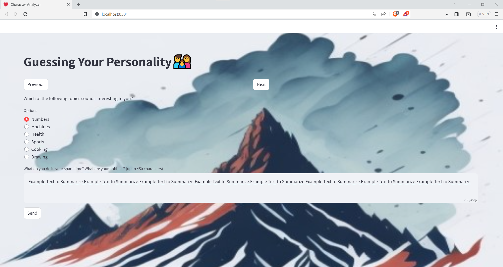

# Character Analyzer Project



Character Analyzer is a Streamlit web application that aims to guess your personality based on your responses to a series of questions. It also allows you to provide information about your hobbies and interests and provides a summary of that input.

## Installation

To run the Character Analyzer project locally, you need to follow these steps:

1. Clone the repository from GitHub:

```
git clone https://github.com/g-hano/character-analyzer.git
cd character-analyzer
```

2. Install the required dependencies. It is recommended to use a virtual environment to manage dependencies:

```
pip install -r requirements.txt
```

3. Run the Streamlit application:

```
streamlit run app.py
```

The application should now be running locally, and you can access it in your web browser at `http://localhost:8501`.

## Usage

Once the application is running, you will see a web page titled "Guessing Your Personality👨‍👩‍👦". The page background displays an image related to the project.

### Instructions

1. You will be presented with a series of questions.

2. For each question, select the most appropriate option from the available choices using the radio buttons.

3. After answering all the questions, you can provide additional information about yourself in the "What do you do in your spare time? What are your hobbies?" text area. Make sure that your response contains up to 450 characters.

4. Click the "Send" button to submit your response.

### Question Navigation

- To navigate to the previous question, click the "Previous" button (located on the left side of the page).

- To proceed to the next question, click the "Next" button (located on the right side of the page).

### Personality Analysis

Once you submit your responses by clicking the "Send" button, the application will attempt to summarize the information you provided in the text area. The summary will be displayed below the text area.

Please note that the character analysis provided by this application is meant for entertainment purposes only and should not be taken as a serious personality assessment.

## Data Files

The project uses a JSON file named `questions.json` to store the questions and answer options presented to the user. This file contains a list of question objects, where each object has the following structure:

```json
{
  "question": "What's your style of learning?",
  "options": [
      "Listening",
      "Reading",
      "Writing"
    ]
}
```

## Model and Dependencies

The Character Analyzer project utilizes the Hugging Face's `transformers` library for text summarization, specifically the "facebook/bart-large-cnn" model. The `streamlit` library is used for building the web application.

## Contributing

Contributions to the project are welcome. If you find any issues or have suggestions for improvement, please open an issue or submit a pull request on the GitHub repository.
